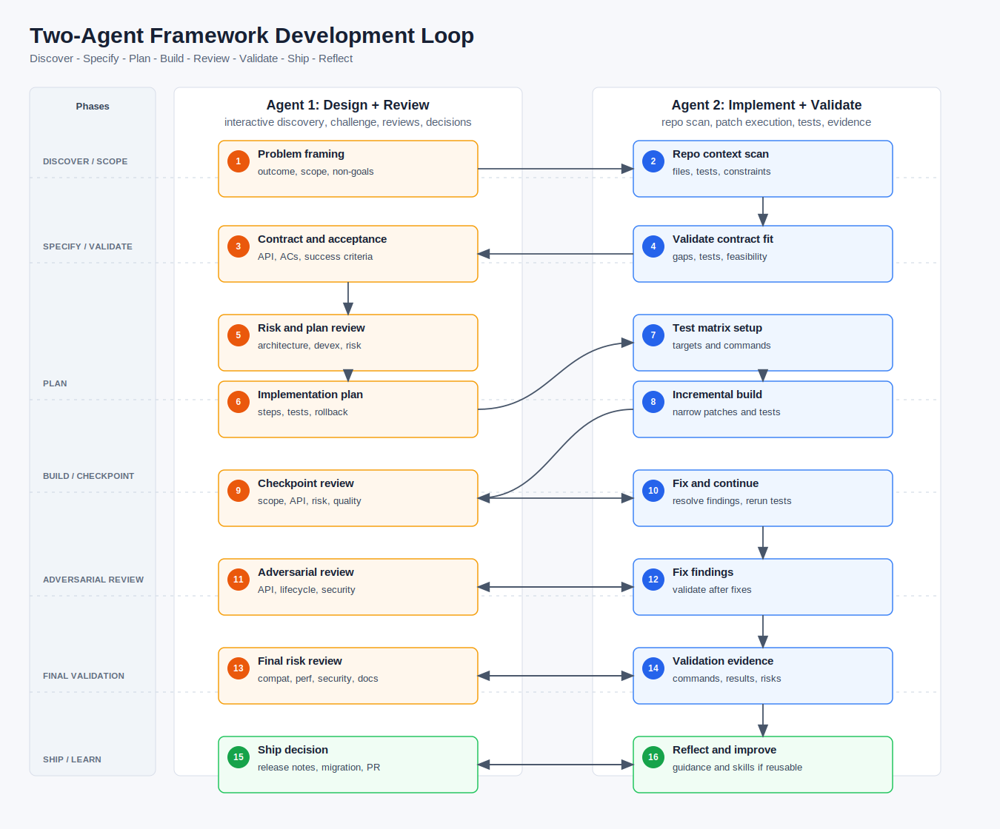

# Agentic Workflow Kit

Portable agent workflow files for using Codex, Claude Code, DAE/ATDD, gstack-style reviews, Superpowers/GSD-style planning, and official-docs lookup across software projects.

The kit is intentionally project-agnostic. Copy it into a workspace or project root, then add project-specific rules in the nearest `AGENTS.md` or `CLAUDE.md`.

## What Is Included

```text
AGENTS.md                       # portable workflow policy for coding agents
CLAUDE.md                       # Claude Code entrypoint that imports AGENTS.md
SKILL_CATALOG.md                # explicit inventory of bundled and external skills
docs/README.md                  # index of dedicated stack-layer guides
docs/*_README.md               # dedicated stack-layer guides
.claude/AGENTIC_WORKFLOW.md     # canonical commands, prompts, and workflow guide
.claude/README.md               # short Claude Code orientation
assets/two-agent-framework-loop.svg    # lifecycle diagram asset
.agents/skills/*/SKILL.md       # bundled Codex-native skills
.claude/skills/*/SKILL.md       # Claude Code compatibility mirror
.codex/AGENTS.md                # Codex-specific lightweight guidance
```

## Install Into A Project

From this repository:

```bash
cp AGENTS.md CLAUDE.md SKILL_CATALOG.md /path/to/project/
mkdir -p /path/to/project/.agents /path/to/project/.claude /path/to/project/.codex /path/to/project/assets
cp -R docs /path/to/project/
cp assets/two-agent-framework-loop.svg /path/to/project/assets/
cp .claude/AGENTIC_WORKFLOW.md .claude/README.md /path/to/project/.claude/
cp -R .agents/skills /path/to/project/.agents/
cp -R .claude/skills /path/to/project/.claude/
cp .codex/AGENTS.md /path/to/project/.codex/
```

Then add project-specific guidance in `/path/to/project/AGENTS.md` or a nested subsystem `AGENTS.md` as needed. Nearest guidance should override this portable workflow.

## Two-Agent Framework Loop

Use this loop for framework or library work where design quality, compatibility, testing, and release readiness matter. The diagram is role-based: Agent 1 handles interactive design and review; Agent 2 handles repo-grounded implementation and validation.

Default Claude + Codex mapping: Agent 1 = Claude Code, Agent 2 = Codex. The generic stage matrix, skill mapping, prompts, and fallback instructions live in `.claude/AGENTIC_WORKFLOW.md`.



## Bundled Local Skills

This repo includes Codex-native skills under `.agents/skills/` and a Claude Code compatibility mirror under `.claude/skills/`:

| Skill | Purpose |
|---|---|
| `agentic-lightweight-loop` | Routine context -> plan -> implement -> verify -> handoff loop |
| `agentic-formal-feature` | GSD/Superpowers/DAE-style formal spec and implementation workflow |
| `agentic-role-review` | gstack-style multi-role review and ship-readiness layer |
| `framework-contract-review` | Framework/API compatibility, lifecycle, performance, security, docs, test matrix, and release review |

See `SKILL_CATALOG.md` for the full inventory and external install notes.

## Usage Docs

- `.claude/AGENTIC_WORKFLOW.md`: canonical operating guide for the two-agent loop, gstack-style review, fallback prompts, and Claude/Codex handoffs.
- `docs/README.md`: index for all dedicated stack-layer guides.
- `docs/DAE_README.md`: DAE/ATDD install, Claude Code boundaries, Codex handoff prompts, and Codex-native porting options.
- `docs/*_README.md`: dedicated guides for Superpowers, ponytail, gstack, GSD Core, repo guidance, framework skills, review/security tooling, and docs lookup.
- `SKILL_CATALOG.md`: bundled skill inventory, external tool notes, and Codex skill invocation examples.
- `AGENTS.md`: portable repo guidance for coding agents.
- `CLAUDE.md`: Claude Code entrypoint that imports the shared guidance.

## License

Add the license appropriate for your organization before publishing publicly.
